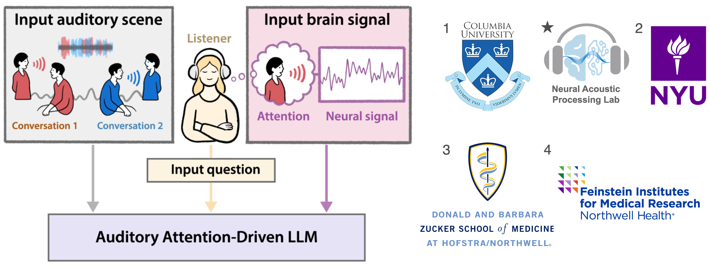

***Xilin Jiang1★, Sukru Samet Dindar1★, Vishal Choudhari1★, Stephan Bickel3,4, Ashesh Mehta3,4, Guy M McKhann1, Adeen Flinker2, Daniel Friedman2, Nima Mesgarani1★***

*First two authors conntribute equally.*

Auditory foundation models, including auditory large language models (LLMs), process all sound inputs equally, independent of listener perception. However, human auditory perception is inherently selective: listeners focus on specific speakers while ignoring others in complex auditory scenes. Existing models do not incorporate this selectivity, limiting their ability to generate perception-aligned responses. To address this, we introduce Intention-Informed Auditory Scene Understanding (II-ASU) and present Auditory Attention-Driven LLM (AAD-LLM), a prototype system that integrates brain signals to infer listener attention. AAD-LLM extends an auditory LLM by incorporating intracranial electroencephalography (iEEG) recordings to decode which speaker a listener is attending to and refine responses accordingly. The model first predicts the attended speaker from neural activity, then conditions response generation on this inferred attentional state. We evaluate AAD-LLM on speaker description, speech transcription and extraction, and question answering in multitalker scenarios, with both objective and subjective ratings showing improved alignment with listener intention. By taking a first step toward intention-aware auditory AI, this work explores a new paradigm where listener perception informs machine listening, paving the way for future listener-centered auditory systems.

* * *

#### **Clinical Sample 1: Female and Male**

  

    <b>🎧 Speech Mixture</b> 
    <audio controls>
      <source src="samples/CS1/mix.wav" type="audio/wav">
      Your browser does not support the audio element.
    </audio>
  

  

    <b>💡 Attended Speech</b> (hidden from models) 
    <audio controls>
      <source src="samples/CS1/att.wav" type="audio/wav">
      Your browser does not support the audio element.
    </audio>
  

  <table>
    <tr>
      <th>Question 1</th>
      <th>Model Answers 1</th>
      <th>Question 2</th>
      <th>Model Answers 2</th>
      <th>Question 3</th>
      <th>Model Answers 3</th>
    </tr>
    <tr>
      <td>Who is the speaker that the subject is paying attention to?</td>
      <td rowspan="3">
        SALMONN: <i>The speaker is a woman.</i>  
        Qwen2-Audio: <i>The specific identity of the speaker is unknown without additional context.</i>  
        <b>AAD-LLM</b>: <i>A female speaker with high pitch and normal tempo.</i>
      </td>
      <td>Transcribe the attended speaker.</td>
      <td rowspan="3">
        SALMONN: <i>We do offer sessions with our five minute personal trainers.</i>  
        Qwen2-Audio: <i>um sandwich place with a five minute drive from this area.</i>  
        <b>AAD-LLM</b>: <i>We do offer sessions with our personal trainers.</i>
      </td>
      <td>What is the unattended speaker's speech about?</td>
      <td rowspan="3">
        SALMONN: <i>Offering sessions with personal personal trainers.</i>  
        Qwen2-Audio: <i>The unattended speaker's speech is inaudible...</i>  
        <b>AAD-LLM</b>: <i>Tom's Sandwich Place is five minutes away.</i>
      </td>
    </tr>
    <tr>
      <td><b>Oracle Answer 1</b></td>
      <td><b>Oracle Answer 2</b></td>
      <td><b>Oracle Answer 3</b></td>
    </tr>
    <tr>
      <td><i>A female speaker with high pitch and normal tempo.</i></td>
      <td><i>We do offer sessions with our personal trainers.</i></td>
      <td><i>Tom's Sandwich Place is five minutes away.</i></td>
    </tr>
  </table>

#### **Clinical Sample 2: Female and Female**

  

    <b>🎧 Speech Mixture</b> 
    <audio controls>
      <source src="samples/CS2/mix.wav" type="audio/wav">
      Your browser does not support the audio element.
    </audio>
  

  

    <b>💡 Attended Speech</b> (hidden from models) 
    <audio controls>
      <source src="samples/CS2/att.wav" type="audio/wav">
      Your browser does not support the audio element.
    </audio>
  

  <table>
    <tr>
      <th>Question 1</th>
      <th>Model Answers 1</th>
      <th>Question 2</th>
      <th>Model Answers 2</th>
      <th>Question 3</th>
      <th>Model Answers 3</th>
    </tr>
    <tr>
      <td>Please write down all words spoken by the attended speaker.</td>
      <td rowspan="3">
        SALMONN: <i>I'm a vintage changer to my second twentieth class cost.</i>  
        Qwen2-Audio: <i>Mike gave a ginger to me on my twenty-first birthday.</i>  
        <b>AAD-LLM</b>: <i>My uncle gifted Ginger to me on my twentieth birthday.</i>
      </td>
      <td>What was the occasion for the gift?</td>
      <td rowspan="3">
        SALMONN: <i>The occasion for the gift is not mentioned in the given sentence.</i>  
        Qwen2-Audio: <i>The occasion for the gift was Mike's birthday.</i>  
        <b>AAD-LLM</b>: <i>The occasion was my twentieth birthday.</i>
      </td>
      <td>Can you identify the person the subject is NOT listening to?</td>
      <td rowspan="3">
        SALMONN: <i>No, I cannot identify the person the subject is not listening to.</i>  
        Qwen2-Audio: <i>Mike.</i>  
        <b>AAD-LLM</b>: <i>A female speaker with high pitch and normal tempo.</i>
      </td>
    </tr>
    <tr>
      <td><b>Oracle Answer 1</b></td>
      <td><b>Oracle Answer 2</b></td>
      <td><b>Oracle Answer 3</b></td>
    </tr>
    <tr>
      <td><i>My uncle gifted ginger to me on my twentieth birthday.</i></td>
      <td><i>The gift was given on the speaker's twentieth birthday.</i></td>
      <td><i>A female speaker with high pitch and normal tempo.</i></td>
    </tr>
  </table>

#### **Clinical Sample 3: Male and Male**

  

    <b>🎧 Speech Mixture</b> 
    <audio controls>
      <source src="samples/CS3/mix.wav" type="audio/wav">
      Your browser does not support the audio element.
    </audio>
  

  

    <b>💡 Attended Speech</b> (hidden from models) 
    <audio controls>
      <source src="samples/CS3/att.wav" type="audio/wav">
      Your browser does not support the audio element.
    </audio>
  

  <table>
    <tr>
      <th>Question 1</th>
      <th>Model Answers 1</th>
      <th>Question 2</th>
      <th>Model Answers 2</th>
      <th>Question 3</th>
      <th>Model Answers 3</th>
    </tr>
    <tr>
      <td>What is the attended speech about?</td>
      <td rowspan="3">
        SALMONN: <i>A high school reunion.</i>  
        Qwen2-Audio: <i>The high time to start thinking about having children.</i>  
        <b>AAD-LLM</b>: <i>Time to consider carbon neutrality options.</i>
      </td>
      <td>What phrase indicates urgency in the speaker's statement?</td>
      <td rowspan="3">
       SALMONN: <i>I THINK IT IS HIGH TIME THAT WE START THINKING ABOUT THE NOT TOO DISTANT FUTURE.</i>  
        Qwen2-Audio: <i>The phrase "it is high time that we start thinking about" indicates urgency.</i>  
        <b>AAD-LLM</b>: <i>The phrase "high time" indicates urgency.</i>
      </td>
      <td>In the unattended speech, on what floor does the speaker want the room?</td>
      <td rowspan="3">
        SALMONN: <i>The speaker wants the room on the top floor.</i>  
        Qwen2-Audio: <i>The speaker wants the room on the ground floor.</i>  
        <b>AAD-LLM</b>: <i>The ninth floor.</i>
      </td>
    </tr>
    <tr>
      <td><b>Oracle Answer 1</b></td>
      <td><b>Oracle Answer 2</b></td>
      <td><b>Oracle Answer 3</b></td>
    </tr>
    <tr>
      <td><i>Time to consider carbon neutrality now.</i></td>
      <td><i>The phrase "high time" indicates urgency in the speaker's statement.</i></td>
      <td><i>The speaker wants the room on the ninth floor.</i></td>
    </tr>
  </table>

* * *

#### **Same-Topic Sample 1**

#### **Same-Topic Sample 2**

* * *

#### **LibriTTS+DNS Sample 1**

#### **LibriTTS+DNS Sample 2**

* * *

#### **Failure Case 1**

#### **Failure Case 2**

* * *

*Within this study, approval of all ethical and experimental procedures and protocols was granted by the university's Institutional Review Board (IRB). The iEEG participants provided informed consent as per the local IRB regulations (IRB protocol number AAAD5482).*

